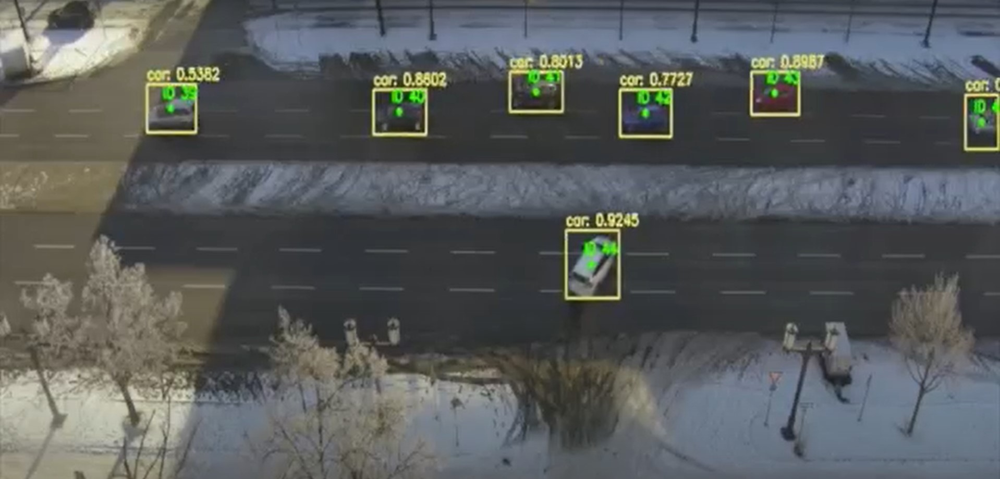

# Detection and Tracking of Vehicles with OpenCV

Project by Wepan Chada, Christian Bilgic and Martin Meyer.
The project goal was to detect and track vehicles in real time and storing obtained information in a relational database

## Detector
* several detectors were tested like Frame Differencing and YOLO 
* Training of own detection model based on YOLO v4 tiny, because trained models on common dataset like COCO did not perform satisfactory on used camera perspective
* Labelling of own data to better account for vehicle occlusions
* Final Model able to reliably detect vehicles with an AP and a F1 Score of 98 % and average IoU of 88 %
* On a GPU computing cluster with CUDA enabled support for OpenCV model was able to reach 25 Frames per Secong 

## Tracker
* Implementation & Benchmarking of Mean shift, Deep Sort and Centroid Tracking Methods
* Decision on centroid tracking method because of highest performance
* Modification of tracking algorithm to specific use case by implementing deregister zones

## Database
* storing obtained information in a relational database

## Config File
* Config file with changeable parameters: debug mode, video save, FPS settings, path settings, region of interest, confidence & threshold of Yolo, methods on/off

# Demo Video

